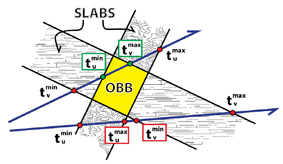
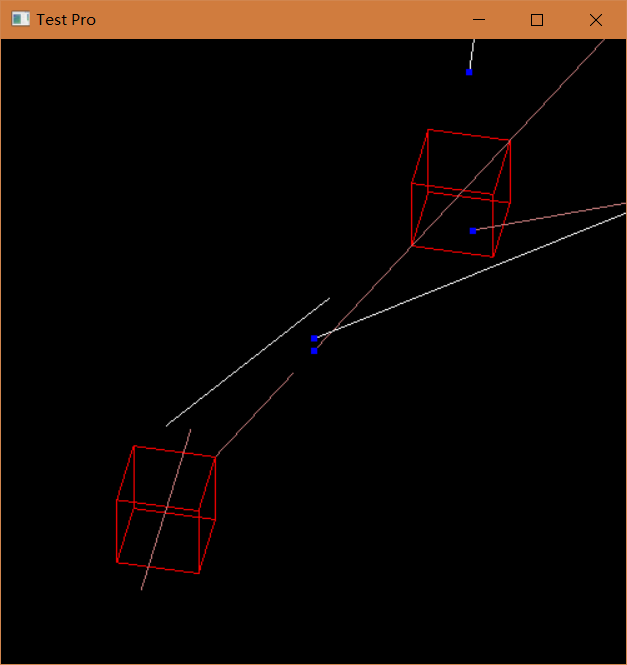

# AABB-ray and AABB-segment slab method

Slab method is used to detect the intersection of the **bounding box** and the **ray**. On this basis, I only modify a very small part of the code, so that the algorithm can be used for **Segment** detection. Slab method for for ray intersection detection can be shown below:

In this code, `AABB_is_hit_ray` and `AABB_is_hit_segment` functions are major algorithm (They are pretty the same), I use C/C++ and CGAL to create **Segment**, **Ray**, **AABB** and etc, use OpenGL to display the above geometry:

