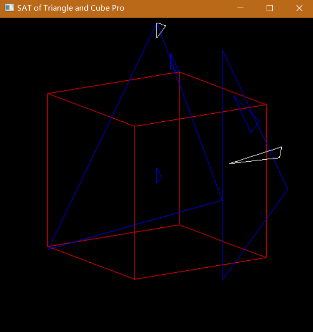
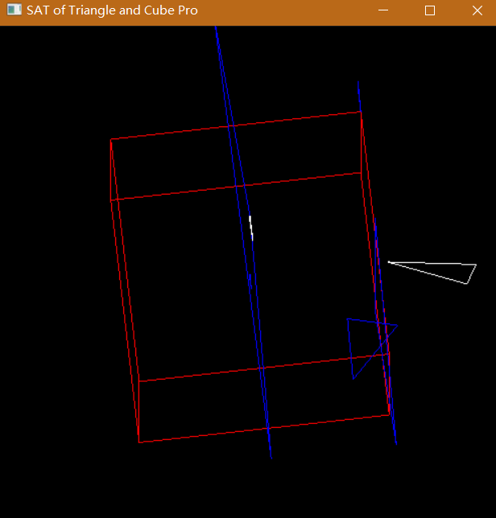

# SAT - Separating Axes Theorem (Take cubes and triangles as an example)

This algorithm is used to quickly determine the intersection of a cube and a triangle face. `In fact, SAT can be used to judge the intersection of many polygons`.

In this code, `I did not add other third-party libraries except the OpenGL library`. 

As follows(`red` is cube, `blue` is triangle intersects cube, `white` is triangle that does not intersect with cube):

In this code, `projections.h` possess major algorithm like another code written by Tao Ju [2004. SIGGRAPH. Robust Repair of Polygonal Model]

`data.in` has some test data to test the correctness of the code, the **first line** is two point of a cube, the **second line** is number of the triangles, **in next lines**, per line have three points of per triangle.
